# 🛠️ Paddi 開発者ガイド

## 📋 目次

- [アーキテクチャ](#アーキテクチャ)
- [開発環境のセットアップ](#開発環境のセットアップ)
- [プロジェクト構成](#プロジェクト構成)
- [エージェントの詳細](#エージェントの詳細)
- [テスト](#テスト)
- [CI/CD](#cicd)
- [貢献方法](#貢献方法)

## 🏗️ アーキテクチャ

Paddiはマルチエージェントアーキテクチャを採用しています。

```mermaid
graph TB
    subgraph Core Pipeline
        A[Collector Agent] -->|collected.json| B[Explainer Agent]
        B -->|explained.json| C[Reporter Agent]
        C --> D[監査レポート]
    end
    
    subgraph AI Agents
        E[Orchestrator] --> F[Autonomous Auditor]
        E --> G[Recursive Auditor]
        E --> H[LangChain Auditor]
        E --> I[Conversational Interface]
    end
    
    subgraph Safety System
        J[Safety Check] --> K[Approval Workflow]
        J --> L[Audit Logger]
    end

    style A fill:#4285f4,stroke:#1a73e8,stroke-width:2px,color:#fff
    style B fill:#ea4335,stroke:#d33b27,stroke-width:2px,color:#fff
    style C fill:#34a853,stroke:#1e8e3e,stroke-width:2px,color:#fff
    style D fill:#fbbc04,stroke:#f9ab00,stroke-width:2px,color:#000
```



### 設計原則

- **単一責任の原則**: 各エージェントは1つの明確な責任を持つ
- **疎結合**: エージェント間はJSONファイルで通信
- **テスタビリティ**: 各エージェントは独立してテスト可能
- **拡張性**: 新しいクラウドプロバイダーやレポート形式を容易に追加可能

## 🚀 開発環境のセットアップ

### 前提条件

- Python 3.10以上
- Google Cloud SDK（実際のGCP監査用）
- Node.js（HonKitドキュメント生成用）

### セットアップ手順

```bash
# リポジトリをクローン
git clone https://github.com/susumutomita/Paddi.git
cd Paddi

# Python仮想環境を作成
python -m venv venv
source venv/bin/activate  # Windows: venv\Scripts\activate

# 開発用依存関係をインストール
pip install -r requirements.txt
pip install -r requirements-dev.txt

# pre-commitフックをセットアップ
pre-commit install
```

## 📁 プロジェクト構成

```
Paddi/
├── app/
│   ├── agents/             # AIエージェント
│   │   ├── autonomous_auditor.py
│   │   ├── recursive_auditor.py
│   │   ├── langchain_auditor.py
│   │   ├── orchestrator.py
│   │   └── conversation.py
│   ├── collector/           # データ収集エージェント
│   │   ├── agent_collector.py
│   │   ├── multi_cloud_collector.py
│   │   └── scc_collector.py
│   ├── explainer/          # AI分析エージェント
│   │   ├── agent_explainer.py
│   │   ├── ollama_explainer.py
│   │   └── prompt_templates.py
│   ├── reporter/           # レポート生成エージェント
│   │   └── agent_reporter.py
│   ├── providers/          # マルチクラウドプロバイダー
│   │   ├── gcp.py
│   │   ├── aws.py
│   │   ├── azure.py
│   │   └── github.py
│   ├── safety/            # 安全性チェックシステム
│   ├── cli/               # CLIインターフェース
│   ├── api/               # Web API
│   └── tests/             # ユニットテスト
├── web/                   # Web UI
├── templates/             # レポートテンプレート
├── docs/                  # ドキュメント
├── terraform/             # インフラ定義（Cloud Run）
└── Makefile              # 開発タスク
```

## 🔍 エージェントの詳細

### Collector Agent

**ファイル**: `app/collector/agent_collector.py`

**責任**: GCP設定データの収集

**主な機能**:
- IAMポリシーの取得
- Security Command Center findingsの収集
- モックデータのサポート

**拡張ポイント**:
```python
class BaseCloudCollector(ABC):
    @abstractmethod
    def collect_iam_policies(self) -> List[Dict]:
        pass
```

### Explainer Agent

**ファイル**: `app/explainer/agent_explainer.py`

**責任**: AIを使用したセキュリティリスク分析

**プロバイダー**:
- Vertex AI (Gemini)
- Ollama（ローカルLLM）

**ファクトリーパターン**:
```python
def get_analyzer(config: Dict[str, Any]) -> LLMInterface:
    provider = config.get("ai_provider", "gemini")
    if provider == "ollama":
        return OllamaSecurityAnalyzer(...)
    return GeminiSecurityAnalyzer(...)
```

### Reporter Agent

**ファイル**: `app/reporter/agent_reporter.py`

**責任**: 人間が読めるレポートの生成

**出力形式**:
- Markdown
- HTML
- HonKit（Webドキュメント）

## 🧪 テスト

### ユニットテスト

```bash
# 全テストを実行
make test

# カバレッジ付きでテスト
make test-coverage

# 特定のテストのみ
pytest app/tests/test_explainer.py -v
```

### 統合テスト

```bash
# E2Eテストを実行
pytest tests/integration/ -v
```

### テストデータ

モックデータは `app/tests/fixtures/` に配置されています。

## 🔄 CI/CD

### GitHub Actions

`.github/workflows/ci.yml` で以下を実行:
- コード品質チェック（black, flake8, pylint）
- セキュリティチェック（bandit）
- ユニットテスト
- カバレッジレポート（Codecov）

### ローカルでの品質チェック

```bash
# コミット前のチェック
make before-commit

# 個別のチェック
make lint           # リンター実行
make format         # コード整形
make security-check # セキュリティチェック
```

## 🤝 貢献方法

### 開発フロー

1. **Issue作成**: 機能追加やバグ修正の前にIssueを作成
2. **ブランチ作成**: `feature/機能名` または `fix/バグ名`
3. **開発**: TDDで実装
4. **テスト**: `make before-commit` が通ることを確認
5. **PR作成**: mainブランチへのPull Request

### コーディング規約

- **Python**: PEP 8準拠（blackで自動整形）
- **型ヒント**: 全ての関数に型ヒントを付ける
- **Docstring**: Google スタイル
- **テスト**: pytest使用、カバレッジ95%以上

### コミットメッセージ

```
<type>(<scope>): <subject>

<body>

<footer>
```

**type**:
- feat: 新機能
- fix: バグ修正
- docs: ドキュメント
- style: コード整形
- refactor: リファクタリング
- test: テスト
- chore: ビルドやツールの変更

## 🔧 高度な使い方

### カスタムプロンプト

`app/explainer/prompt_templates.py` でプロンプトをカスタマイズ:

```python
CUSTOM_PROMPT = """
あなたの組織特有のセキュリティポリシーに基づいて分析してください。
特に以下の点に注意:
- GDPR準拠
- 社内セキュリティ基準
"""
```

### 新しいクラウドプロバイダーの追加

1. `app/providers/` に新しいプロバイダークラスを作成
2. `BaseProvider` を継承
3. `app/providers/factory.py` に登録

### AIエージェントの追加

1. `app/agents/` に新しいエージェントを作成
2. `orchestrator.py` に登録
3. `paddi_cli.py` にコマンドを追加

## 📊 パフォーマンスガイドライン

- **並行処理**: 複数プロジェクトの監査は `AsyncExecutor` を使用
- **キャッシュ**: 頻繁に使用するAPIレスポンスはキャッシュ
- **バッチ処理**: 大量のリソースは分割して処理

## 🐛 トラブルシューティング

### よくある問題

**問題**: `google.auth.exceptions.DefaultCredentialsError`
```bash
# 解決策
gcloud auth application-default login
```

**問題**: Ollamaが接続できない
```bash
# 解決策
ollama serve  # 別ターミナルで実行
```

### デバッグモード

```bash
# 詳細ログを有効化
export LOG_LEVEL=DEBUG
python main.py audit -v
```

## 📚 参考資料

- [Google Cloud Python Client](https://github.com/googleapis/google-cloud-python)
- [Vertex AI Documentation](https://cloud.google.com/vertex-ai/docs)
- [Ollama Documentation](https://ollama.ai/docs)
- [Fire CLI Framework](https://github.com/google/python-fire)
- [LangChain Documentation](https://python.langchain.com/docs/get_started/introduction)
- [AWS SDK for Python](https://aws.amazon.com/sdk-for-python/)
- [Azure SDK for Python](https://docs.microsoft.com/en-us/azure/developer/python/)