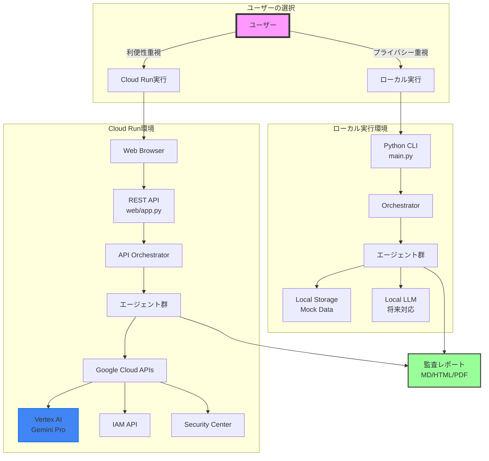
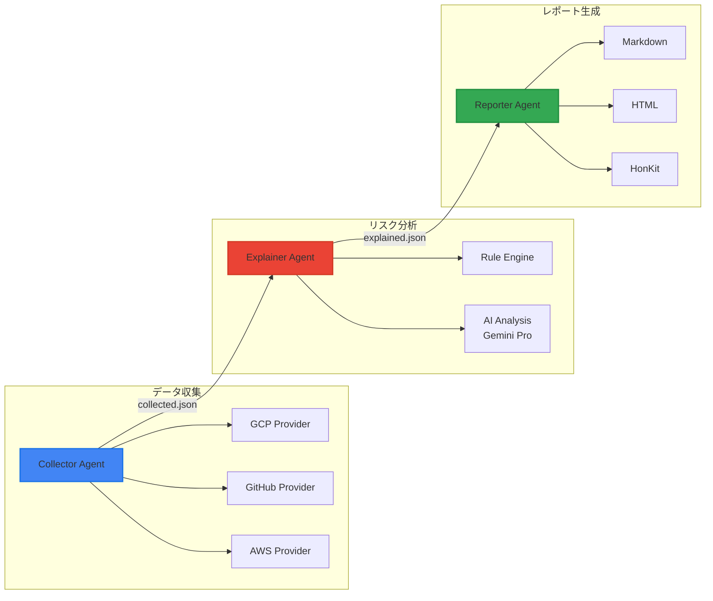
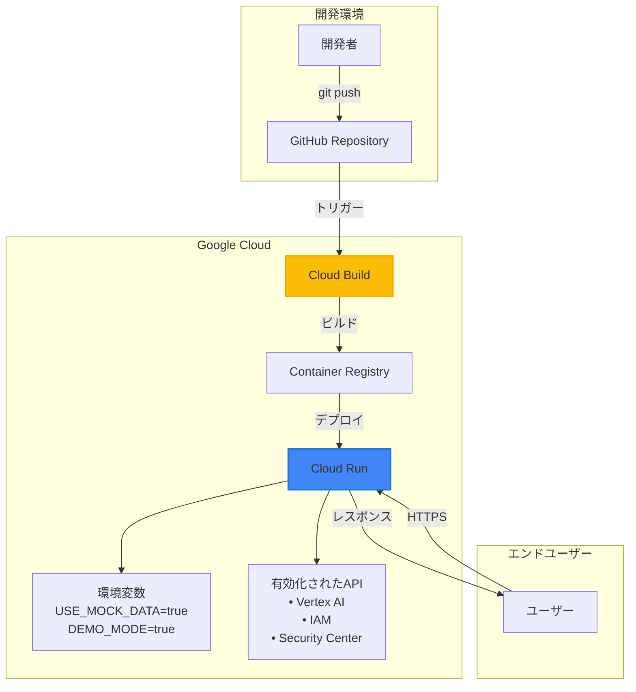
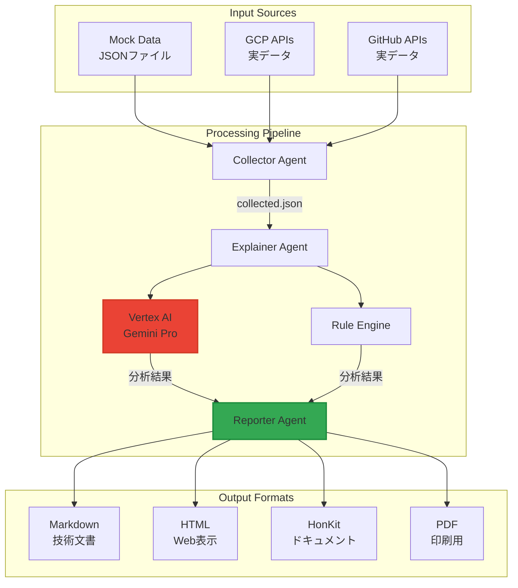
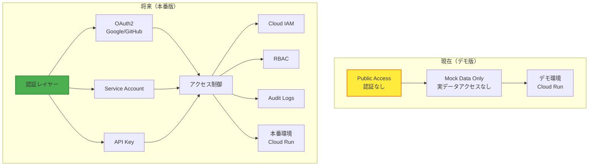
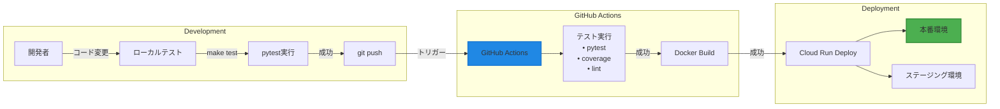

# Paddi アーキテクチャ図（Mermaid版）

## システム全体図

```mermaid
graph TB
    subgraph "ユーザーの選択"
        U[ユーザー]
        U -->|プライバシー重視| L[ローカル実行]
        U -->|利便性重視| C[Cloud Run実行]
    end
    
    subgraph "ローカル実行環境"
        L --> CLI[Python CLI<br/>main.py]
        CLI --> LO[Orchestrator]
        LO --> LA[エージェント群]
        LA --> LS[Local Storage<br/>Mock Data]
        LA --> LL[Local LLM<br/>将来対応]
    end
    
    subgraph "Cloud Run環境"
        C --> WEB[Web Browser]
        WEB --> API[REST API<br/>web/app.py]
        API --> CO[API Orchestrator]
        CO --> CA[エージェント群]
        CA --> GCP[Google Cloud APIs]
        GCP --> VA[Vertex AI<br/>Gemini Pro]
        GCP --> IAM[IAM API]
        GCP --> SCC[Security Center]
    end
    
    LA --> OUT[監査レポート<br/>MD/HTML/PDF]
    CA --> OUT
    
    style U fill:#f9f,stroke:#333,stroke-width:4px
    style OUT fill:#9f9,stroke:#333,stroke-width:2px
    style VA fill:#4285f4,stroke:#1a73e8,stroke-width:2px
```

## エージェントパイプライン

```mermaid
graph LR
    subgraph "データ収集"
        A[Collector Agent]
        A1[GCP Provider]
        A2[GitHub Provider]
        A3[AWS Provider]
        A --> A1
        A --> A2
        A --> A3
    end
    
    subgraph "リスク分析"
        B[Explainer Agent]
        B1[Rule Engine]
        B2[AI Analysis<br/>Gemini Pro]
        B --> B1
        B --> B2
    end
    
    subgraph "レポート生成"
        C[Reporter Agent]
        C1[Markdown]
        C2[HTML]
        C3[HonKit]
        C --> C1
        C --> C2
        C --> C3
    end
    
    A -->|collected.json| B
    B -->|explained.json| C
    
    style A fill:#4285f4,stroke:#1a73e8,stroke-width:2px
    style B fill:#ea4335,stroke:#d33b27,stroke-width:2px
    style C fill:#34a853,stroke:#1e8e3e,stroke-width:2px
```

## デプロイフロー

```mermaid
graph TD
    subgraph "開発環境"
        DEV[開発者]
        GIT[GitHub Repository]
        DEV -->|git push| GIT
    end
    
    subgraph "Google Cloud"
        GIT -->|トリガー| CB[Cloud Build]
        CB -->|ビルド| CR[Container Registry]
        CR -->|デプロイ| RUN[Cloud Run]
        
        RUN --> ENV[環境変数<br/>USE_MOCK_DATA=true<br/>DEMO_MODE=true]
        RUN --> APIS[有効化されたAPI<br/>• Vertex AI<br/>• IAM<br/>• Security Center]
    end
    
    subgraph "エンドユーザー"
        USER[ユーザー]
        USER -->|HTTPS| RUN
        RUN -->|レスポンス| USER
    end
    
    style CB fill:#fbbc04,stroke:#f9ab00,stroke-width:2px
    style RUN fill:#4285f4,stroke:#1a73e8,stroke-width:2px
```

## データフロー詳細

```mermaid
flowchart TD
    subgraph "Input Sources"
        I1[Mock Data<br/>JSONファイル]
        I2[GCP APIs<br/>実データ]
        I3[GitHub APIs<br/>実データ]
    end
    
    subgraph "Processing Pipeline"
        COL[Collector Agent]
        I1 --> COL
        I2 --> COL
        I3 --> COL
        
        COL -->|collected.json| EXP[Explainer Agent]
        
        AI[Vertex AI<br/>Gemini Pro]
        RULE[Rule Engine]
        EXP --> AI
        EXP --> RULE
        
        AI -->|分析結果| REP[Reporter Agent]
        RULE -->|分析結果| REP
    end
    
    subgraph "Output Formats"
        O1[Markdown<br/>技術文書]
        O2[HTML<br/>Web表示]
        O3[HonKit<br/>ドキュメント]
        O4[PDF<br/>印刷用]
        
        REP --> O1
        REP --> O2
        REP --> O3
        REP --> O4
    end
    
    style AI fill:#ea4335,stroke:#d33b27,stroke-width:2px
    style REP fill:#34a853,stroke:#1e8e3e,stroke-width:2px
```

## セキュリティアーキテクチャ

```mermaid
graph TB
    subgraph "現在（デモ版）"
        PUB[Public Access<br/>認証なし]
        PUB --> MOCK[Mock Data Only<br/>実データアクセスなし]
        MOCK --> DEMO[デモ環境<br/>Cloud Run]
    end
    
    subgraph "将来（本番版）"
        AUTH[認証レイヤー]
        O2[OAuth2<br/>Google/GitHub]
        SA[Service Account]
        KEY[API Key]
        
        AUTH --> O2
        AUTH --> SA
        AUTH --> KEY
        
        AC[アクセス制御]
        IAM2[Cloud IAM]
        RBAC[RBAC]
        LOG[Audit Logs]
        
        O2 --> AC
        SA --> AC
        KEY --> AC
        
        AC --> IAM2
        AC --> RBAC
        AC --> LOG
        
        PROD[本番環境<br/>Cloud Run]
        AC --> PROD
    end
    
    style PUB fill:#ffeb3b,stroke:#f57f17,stroke-width:2px
    style AUTH fill:#4caf50,stroke:#388e3c,stroke-width:2px
```

## CI/CD パイプライン

```mermaid
graph LR
    subgraph "Development"
        D[開発者] -->|コード変更| L[ローカルテスト]
        L -->|make test| T[pytest実行]
        T -->|成功| P[git push]
    end
    
    subgraph "GitHub Actions"
        P -->|トリガー| GA[GitHub Actions]
        GA --> TEST[テスト実行<br/>• pytest<br/>• coverage<br/>• lint]
        TEST -->|成功| BUILD[Docker Build]
    end
    
    subgraph "Deployment"
        BUILD -->|成功| DEPLOY[Cloud Run Deploy]
        DEPLOY --> PROD[本番環境]
        DEPLOY --> STAGE[ステージング環境]
    end
    
    style GA fill:#2088e4,stroke:#1976d2,stroke-width:2px
    style PROD fill:#4caf50,stroke:#388e3c,stroke-width:2px
```

## ユースケース別フロー

```mermaid
graph TD
    subgraph "個人開発者"
        DEV1[開発者] -->|git clone| LOCAL1[ローカル環境]
        LOCAL1 -->|python main.py| REPORT1[レポート生成]
        REPORT1 -->|統合| CI1[CI/CD Pipeline]
    end
    
    subgraph "企業セキュリティチーム"
        SEC[セキュリティチーム] -->|ブラウザ| CLOUD[Cloud Run]
        CLOUD -->|Vertex AI| ANALYSIS[高度な分析]
        ANALYSIS -->|定期実行| SLACK[Slack通知]
    end
    
    subgraph "ハッカソン審査"
        JUDGE[審査員] -->|デモURL| DEMO2[デモ環境]
        DEMO2 -->|ワンクリック| RESULT[監査結果表示]
        JUDGE -->|API試用| CURL[curl コマンド]
        CURL -->|REST API| DEMO2
    end
    
    style DEV1 fill:#e3f2fd,stroke:#1976d2,stroke-width:2px
    style SEC fill:#fce4ec,stroke:#c2185b,stroke-width:2px
    style JUDGE fill:#f3e5f5,stroke:#7b1fa2,stroke-width:2px
```