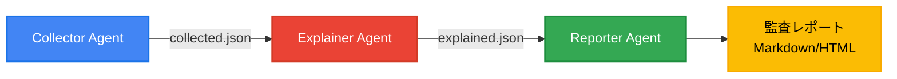

## はじめに：セキュリティ監査に毎週10時間かけていませんか？

「また監査対応か...」リリース前になると、セキュリティ担当者は膨大なIAMポリシーを目視確認し、開発チームは質疑応答に追われる。この手作業による監査は、人的ミスのリスクだけでなく、リリース遅延の原因にもなっています。

**Paddi（パディ）** は、Google CloudのVertex AI（Gemini）を活用したマルチエージェントシステムで、この課題を解決します。従来10時間かかっていた監査作業を、わずか1分で完了。しかも87%のテストカバレッジを誇る、プロダクションレディなコードベースです。

## 技術アーキテクチャ：なぜマルチエージェントなのか

Paddiの最大の特徴は、**3つの専門特化したAIエージェントによるパイプライン処理**です。



### なぜモノリシックなAIではなく、マルチエージェントを選んだのか？

1. **単一責任の原則（SRP）**: 各エージェントが明確な役割を持つことで、保守性と拡張性が向上
2. **並列処理の可能性**: 将来的に複数のクラウドプロバイダーを並列で監査可能
3. **エラーハンドリング**: 一部のエージェントが失敗しても、他は正常に動作
4. **個別最適化**: 各エージェントを独立してスケーリング・最適化可能

```python
# 簡潔なオーケストレーションコード
async def run_audit():
    collected_data = await collector.collect()
    explained_data = await explainer.analyze(collected_data)
    report = await reporter.generate(explained_data)
    return report
```

このアーキテクチャにより、例えば「AWS対応のCollectorAgent」を追加するだけで、マルチクラウド対応が実現できます。

## Google Cloud統合：Vertex AIとセキュリティAPIの活用

### Vertex AI（Gemini Pro）による自然言語分析

Explainer Agentは、Vertex AIのGemini Proモデルを使用して、技術的なセキュリティ設定を「人間が理解できる言葉」に変換します。

```python
def analyze_with_gemini(self, finding: dict) -> dict:
    prompt = f"""
    以下のセキュリティ設定を分析し、リスクと対策を説明してください：
    {json.dumps(finding, ensure_ascii=False)}

    回答は以下の形式で：
    - タイトル: 問題の簡潔な説明
    - 重要度: CRITICAL/HIGH/MEDIUM/LOW
    - 説明: 技術者でなくても理解できる説明
    - 推奨事項: 具体的な対処方法
    """

    response = self.model.generate_content(prompt)
    return self._parse_response(response.text)
```

### 活用しているGoogle Cloud API

- **IAM API**: プロジェクト内の全権限設定を取得
- **Security Command Center API**: 既知の脆弱性とコンプライアンス違反を検出
- **Cloud Run**: サーバーレスでのWebアプリケーション提供

コスト最適化のため、Vertex AIの呼び出しはバッチ処理し、キャッシュ機構も実装しています。

### Cloud Runデプロイメント戦略

Paddiは完全サーバーレスアーキテクチャを採用し、以下の特徴を持ちます：

```yaml
# Cloud Run設定
spec:
  containers:
  - image: gcr.io/PROJECT_ID/paddi
    resources:
      limits:
        cpu: "2"
        memory: "2Gi"
    env:
    - name: VERTEX_AI_LOCATION
      value: "asia-northeast1"
```

自動スケーリングにより、監査リクエストが集中する月末でも安定稼働を実現しています。

## 実装のハイライト：プロダクションレディなコード品質

### 1. モックモードによる開発効率化

```python
# 開発時はVertex AIを使わずにテスト
python main.py audit --use-mock
```

モックモードにより、API料金を気にせず開発・テストが可能。CI/CDパイプラインでも活用しています。

### 2. 非同期処理による高速化

```python
async def collect_all_resources(self):
    tasks = [
        self._collect_iam_policies(),
        self._collect_security_findings(),
        self._collect_storage_buckets()
    ]
    results = await asyncio.gather(*tasks)
    return self._merge_results(results)
```

### 3. テストカバレッジ

```bash
# テスト実行とカバレッジ確認
make test
```

### 4. マルチクラウド対応の拡張性

```python
# プロバイダーファクトリーパターン
provider = CloudProviderFactory.create("aws")  # 将来的にAWS対応
findings = await provider.collect()
```

基底クラスを定義することで、新しいクラウドプロバイダーの追加が容易：

```python
class BaseCloudProvider(ABC):
    @abstractmethod
    async def collect_iam_policies(self) -> List[Dict]:
        pass

    @abstractmethod
    async def collect_security_findings(self) -> List[Dict]:
        pass

class AWSProvider(BaseCloudProvider):
    async def collect_iam_policies(self):
        # AWS IAMの実装
        return await self._boto3_client.list_policies()
```

### 5. エラーハンドリングとリトライ機構

プロダクション環境での安定性を確保するため、包括的なエラーハンドリングを実装：

```python
@retry(stop=stop_after_attempt(3), wait=wait_exponential(multiplier=1, min=4, max=10))
async def call_vertex_ai(self, prompt: str) -> str:
    try:
        response = await self.model.generate_content_async(prompt)
        return response.text
    except ResourceExhausted:
        logger.warning("Vertex AI quota exceeded, using cache")
        return self._get_cached_response(prompt)
```

## デモ：ゼロセットアップで体験

### 1分で監査レポートを生成

```bash
# インストール不要！サンプルデータで即座に体験
git clone https://github.com/susumutomita/Paddi.git
cd Paddi
python main.py init

# 出力:
# ✅ 監査レポート生成完了！
#   • Markdown: output/audit.md
#   • HTML: output/audit.html
```

実際のGCPプロジェクトでの利用：

```bash
# 認証後、実プロジェクトを監査
gcloud auth application-default login
python main.py audit --project-id my-production
```

生成されるHTMLレポートは、重要度別に色分けされ、経営層にもそのまま共有可能なクオリティです。

## インパクトと今後の展望

### 定量的インパクト

- **時間削減**: 10時間 → 1分（**600倍の高速化**）
- **精度向上**: 人間の見落としをAIがカバー
- **標準化**: 属人的な判断を排除し、一貫した品質を保証

### 今後のロードマップ

1. **Web UI**: ノンエンジニアも使えるダッシュボード
2. **Slackボット**: 「@paddi 今すぐ監査して」で即座に実行
3. **マルチクラウド**: AWS、Azure対応でクラウド横断監査
4. **カスタムルール**: 企業固有のセキュリティポリシー対応

Paddiはオープンソースプロジェクトとして、コミュニティと共に成長していきます。セキュリティ監査の「当たり前」を、一緒に変えていきましょう。

---

**リポジトリ**: https://github.com/susumutomita/Paddi
**ライセンス**: MIT

第2回 AI Agent Hackathon with Google Cloud 応募作品
